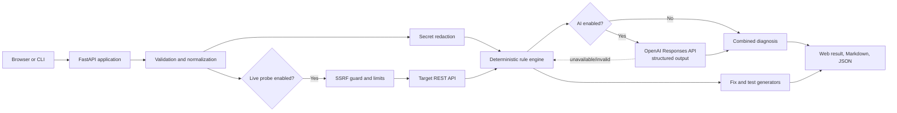

# TraceAid AI

> Turn failed REST API calls into an evidence-based diagnosis and a corrected, testable request.

[](https://github.com/ManosTsagkos/traceaid-ai/actions/workflows/ci.yml)
[](https://www.python.org/)
[](https://fastapi.tiangolo.com/)
[](LICENSE)

**[Repository](https://github.com/ManosTsagkos/traceaid-ai) · [Interactive demo](https://manostsagkos.github.io/traceaid-ai/)**

TraceAid helps a developer turn a failed API call into an incident report: what the evidence supports, what to change, and how to reproduce the fix. It is a personal Python/FastAPI project with a shared API/CLI pipeline, typed contracts, secret redaction, and optional structured AI analysis.

**The browser demo needs no account, installation, API key, or paid service.** It explores six synthetic incidents. Reports and code templates come from the real Python rules engine at build time; GitHub Pages does not run the backend. The local application accepts custom evidence and can optionally use OpenAI or probe an explicitly enabled target.

## Explore in one minute

1. Open the [interactive demo](https://manostsagkos.github.io/traceaid-ai/) and choose **Wrong HTTP method**. The report uses the server's `Allow` header to change `POST` to `GET`.
2. Choose **Missing JSON content type** to see an evidence-supported header correction.
3. Open the **Python** and **pytest** tabs, then export the report as JSON or Markdown. Authentication examples mask the credential and read a replacement from an environment variable.
4. Inspect the [diagnosis service](src/traceaid/services/diagnosis.py), [regression tests](tests/unit/test_static_demo.py), or [architecture decisions](docs/ARCHITECTURE.md) to follow the result back to the implementation.

Generated requests are reviewable templates: a `401` does not prove a token expired, and a validation error cannot reveal missing business values. TraceAid keeps those limits visible instead of inventing a complete fix.

## Why this project?

An HTTP status code tells you *what* happened, but usually not *why* or how to fix it. Debugging then becomes a loop of searching documentation, editing headers, replaying requests, and writing a regression test after the fact. TraceAid turns that loop into one workflow:

1. Enter request and response evidence, or parse a `curl` command through the API.
2. Receive ranked findings from deterministic rules.
3. Optionally enrich the findings with a schema-validated AI analysis.
4. Copy corrected `curl`, Python, and `pytest` snippets.
5. Export the report as Markdown or JSON.

## Features

| Capability | What it provides |
| --- | --- |
| Deterministic diagnosis | Explainable findings for authentication, authorization, validation, rate limits, content negotiation, server errors, timeouts, and common connectivity failures. |
| Optional AI analysis | OpenAI Responses API integration with structured output validation and a deterministic fallback when AI is disabled or unavailable. |
| `curl` parsing | Converts a pasted command into editable method, URL, header, query, and body fields. |
| Corrected request generation | Ready-to-copy `curl`, Python `httpx`, and `pytest` examples based on the proposed fix. |
| Secret-aware processing | Redacts API keys, bearer tokens, cookies, authorization headers, and other likely credentials from reports and logs. |
| SSRF protections | Live probes are off by default; when enabled, URL validation blocks unsafe schemes, local/private destinations, and redirect-based bypasses. |
| Demo mode | Built-in examples show useful results without an API key or outbound network access. |
| Portable reports | Download the complete diagnosis as Markdown or machine-readable JSON. |
| API-first design | Versioned REST endpoints, generated OpenAPI docs, typed Pydantic contracts, and a small CLI entry point. |

## Product tour


*A prepared report from the real rules engine, with redacted evidence, suggested fixes, and code templates. Credentials and endpoint-specific validation values must be supplied and reviewed before running a generated request against a real service.*

## Architecture



The deterministic engine always remains the source of baseline findings. AI is an optional enhancement. See [Architecture](docs/ARCHITECTURE.md) and [Threat model](docs/THREAT_MODEL.md) for the design details.

### Engineering decisions you can inspect

| Decision | Implementation and verification |
| --- | --- |
| One diagnosis pipeline for API, CLI, and prepared demo | [Orchestration service](src/traceaid/services/diagnosis.py); [API contracts](tests/integration/test_api.py) and [demo reproducibility tests](tests/unit/test_static_demo.py). |
| AI failure preserves a usable baseline | [Structured provider and fallback](src/traceaid/services/llm.py); [mocked provider tests](tests/unit/test_llm_generators_diagnosis.py). No credentials are needed in CI. |
| Probe execution needs both server and request opt-in | [URL policy](src/traceaid/services/url_security.py), [bounded probe](src/traceaid/services/probe.py), and [unsafe-destination tests](tests/unit/test_url_probe.py). |
| Generated code must run, not merely look plausible | [Renderers](src/traceaid/services/generators.py); generated code executes against mocked HTTP. Python handles JSON, plain text, and empty responses; pytest requires `2xx` and rejects an unfollowed redirect. |
| A release must contain the actual application | [Installed-wheel smoke check](scripts/check-installed.py) verifies the packaged web assets, diagnosis endpoint, CLI, and static demo outside an editable source installation. |

## Quick start

### Requirements

- Python 3.11 or newer
- Git
- An OpenAI API key only if you want AI-enriched analysis

### Local development

```bash
git clone https://github.com/ManosTsagkos/traceaid-ai.git
cd traceaid-ai
python -m venv .venv
```

Activate the environment:

```bash
# macOS / Linux
source .venv/bin/activate

# Windows PowerShell
.venv\Scripts\Activate.ps1
```

Install and run:

```bash
python -m pip install -e ".[dev]"
cp .env.example .env  # Windows: Copy-Item .env.example .env
uvicorn traceaid.main:app --reload
```

Open [http://localhost:8000](http://localhost:8000). Interactive API documentation is available at [http://localhost:8000/docs](http://localhost:8000/docs).

TraceAid starts in safe, deterministic mode. To add AI analysis, place your key in `.env`:

```dotenv
OPENAI_API_KEY=your-key-here
OPENAI_MODEL=gpt-4o-mini
```

Never commit `.env`; it is ignored by Git.

### Docker

```bash
docker compose up --build
```

The container runs as a non-root user, uses a read-only filesystem, drops Linux capabilities, and keeps live outbound probes disabled unless explicitly configured.

## Try the demo

Open the **[interactive portfolio demo](https://manostsagkos.github.io/traceaid-ai/)** to load authentication, validation, rate-limit, content-type, method, and timeout cases. Select a case to inspect the evidence, switch between cURL/Python/pytest tabs, copy code, or export JSON/Markdown. Inputs are read-only because GitHub Pages does not execute the backend.

The local web interface runs the actual diagnosis endpoint for editable evidence. A typical scenario is an API returning `401 Unauthorized` because an access token expired. TraceAid identifies the authentication failure, redacts the supplied credential, and generates a request template reading the replacement credential from an environment variable. An authentication failure alone cannot prove that a credential expired.

Build or preview the hosted version locally:

```bash
python -m traceaid.static_demo --output site
python -m traceaid.static_demo --output site --check
python -m http.server 8080 --directory site
```

The builder deliberately ignores API keys and live-probe settings. It never removes existing files; publish only the generated directory from a clean checkout. The Pages workflow builds and tests a fresh site before deployment. Enable GitHub Pages with **GitHub Actions** as its source.

You can also submit a diagnosis directly:

```bash
curl -X POST http://localhost:8000/api/v1/diagnose \
  -H "Content-Type: application/json" \
  -d '{
    "request": {
      "method": "POST",
      "url": "https://api.example.com/v1/orders",
      "headers": {
        "Authorization": "Bearer demo-secret",
        "Content-Type": "application/json"
      },
      "body": {"product_id": "sku_123", "quantity": 1}
    },
    "observed": {
      "status_code": 401,
      "headers": {"Content-Type": "application/json"},
      "body": {"error": "invalid_token"},
      "latency_ms": 183,
      "error": null
    },
    "execute_probe": false,
    "use_ai": false
  }'
```

The response contains a summary, severity-ranked findings, recommended actions, redacted evidence, and corrected code examples. For the complete request and response contracts, see [API reference](docs/API.md).

## REST API

| Method | Endpoint | Purpose |
| --- | --- | --- |
| `GET` | `/` | Web application |
| `GET` | `/api/health` | Readiness and configuration-safe health status |
| `GET` | `/api/v1/meta` | Version and supported-capability metadata |
| `GET` | `/api/v1/examples` | Built-in demo scenarios |
| `POST` | `/api/v1/examples/{example_id}/diagnose` | Run one built-in example through the production pipeline |
| `POST` | `/api/v1/parse-curl` | Parse a `curl` command into structured request fields |
| `POST` | `/api/v1/diagnose` | Run validation, redaction, rules, optional probe, optional AI, and code generation |

FastAPI also exposes OpenAPI at `/api/openapi.json`, Swagger UI at `/docs`, and ReDoc at `/redoc`.

## Configuration

| Variable | Default | Description |
| --- | --- | --- |
| `OPENAI_API_KEY` | empty | Enables optional AI enrichment when present. |
| `OPENAI_MODEL` | `gpt-4o-mini` | Model used by the Responses API adapter. |
| `TRACEAID_ENABLE_LIVE_PROBES` | `false` | Allows server-side replay of validated target requests. Keep disabled for public deployments unless required. |
| `TRACEAID_REQUEST_TIMEOUT_SECONDS` | `8` | Hard timeout for an allowed outbound probe. |
| `TRACEAID_MAX_RESPONSE_BYTES` | `262144` | Maximum response body retained from a probe. |
| `TRACEAID_ALLOWED_ORIGINS` | `http://localhost:8000` | Comma-separated CORS origins. Do not use `*` with credentials. |
| `TRACEAID_LOG_LEVEL` | `INFO` | Application log level. |

## CLI

Installing the project exposes a `traceaid` command:

```bash
traceaid --help
traceaid demo expired-token --format markdown
traceaid diagnose examples/incidents/validation-error.json --format json
```

Use `-` as the diagnosis input path to read an incident from standard input. Add `--use-ai` for optional AI enrichment or `--probe` for an explicitly enabled live request. The CLI uses the same validation, redaction, rules, and output models as the web API, keeping local and server workflows consistent.

## Quality checks

```bash
ruff check .          # lint
ruff format --check . # formatting
mypy src              # static types
pytest                # unit + integration tests with coverage
pip-audit             # dependency vulnerability audit
python -m pip check   # installed dependency compatibility
python -m build       # wheel and source distribution
python -m traceaid.static_demo --output site
python -m traceaid.static_demo --output site --check
npm ci
npx playwright install chromium
npm test              # real-browser checks (static demo + local app + docs CSP)
```

Or run `make check` for Python checks and `make test-browser` after installing Node.js dependencies and Chromium. GitHub Actions executes linting, formatting, type checking, Python tests on 3.11/3.12/3.13, dependency auditing, browser tests, and a build/install smoke test on every push and pull request. The installed-wheel job uses a separate environment to catch missing package assets or source-only imports.

The tests are split between fast rule/parser tests in `tests/unit` and API-level behavior in `tests/integration`. Outbound HTTP and OpenAI calls are mocked; CI never needs real credentials.

The browser suite verifies all six prepared cases, Pages subpaths, copy/export controls, keyboard tabs, mobile layout, real API diagnosis, redaction, malformed input, and truthful API failure handling. Generated Python snippets and regression tests are also executed against mocked HTTP responses; no real target API is contacted.

The documentation CSP regression stubs the third-party Swagger bundle while exercising the real nonce, CDN policy, and OpenAPI fetch. Docker runtime and paid provider calls need separate deployment credentials/infrastructure; the automated suite does not claim to exercise them.

## Security and privacy

TraceAid processes data that can contain credentials. Its safe defaults are deliberate:

- no live target request is sent unless live probes are explicitly enabled;
- sensitive header names and credential-like values are redacted before output and logging;
- unsafe URL schemes, embedded credentials, and loopback/private/link-local targets are rejected, and redirects are not followed;
- request time, response size, and redirect behavior are bounded;
- AI enrichment receives redacted, minimized evidence rather than raw secrets;
- deterministic analysis remains available if the AI provider fails.

This is a diagnostic assistant, not a secure proxy or a substitute for reviewing generated fixes. Read [SECURITY.md](SECURITY.md) before exposing it to untrusted users.

## Project structure

```text
traceaid-ai/
├── .github/                 # CI, issue forms, dependency updates
├── docs/                    # API, architecture, development, threat model
├── examples/incidents/      # credential-free CLI and API inputs
├── src/traceaid/
│   ├── main.py              # FastAPI application and route wiring
│   ├── api.py               # versioned JSON endpoints
│   ├── cli.py               # command-line entry point
│   ├── models.py            # strict Pydantic contracts
│   ├── services/            # rules, redaction, probing, AI, generators
│   └── web/                 # self-contained browser interface
├── tests/
│   ├── unit/
│   └── integration/
├── Dockerfile
├── docker-compose.yml
└── pyproject.toml
```

## Roadmap

- [x] Deterministic HTTP/API diagnostic rules
- [x] Optional structured AI enrichment
- [x] Secret-aware reports and safe-mode defaults
- [x] Corrected `curl`, Python, and `pytest` generation
- [x] Markdown and JSON exports
- [x] Responsive local web interface and CLI
- [ ] Pluggable local-model and additional provider adapters
- [ ] Opt-in, encrypted diagnosis history
- [ ] Team sharing with expiring report links
- [ ] IDE and CI failure-report integrations

## Contributing

Contributions are welcome. See [CONTRIBUTING.md](CONTRIBUTING.md) for setup, quality gates, and pull-request guidance. For vulnerabilities, follow the private reporting process in [SECURITY.md](SECURITY.md).

## License

Released under the [MIT License](LICENSE).

Built by [Manos Tsagkos](https://github.com/ManosTsagkos).
