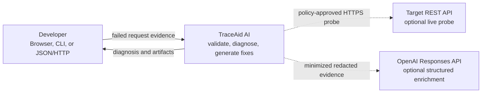
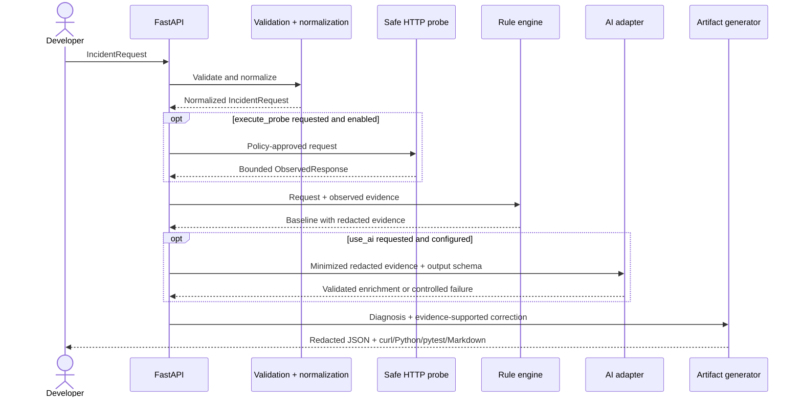

# Architecture

TraceAid is designed around one rule: a useful diagnosis must not depend on an LLM or on replaying an untrusted request. The deterministic pipeline is therefore the baseline; network and AI capabilities are opt-in enrichments around it.

## System context

## Request lifecycle

## Components

### HTTP and web layer

The FastAPI application owns route wiring, Pydantic validation, exception translation, CORS policy, and static browser assets. Both the UI and CLI use the same application models and services; diagnosis behavior is not duplicated in JavaScript.

### Input normalization

Structured input and parsed `curl` commands converge on `RequestSpec`. Normalization makes method, URL, headers, and body predictable before any diagnostic rule runs. The parser treats the command as data: it does not invoke a shell, expand environment variables, or read `@file` content.

### Redaction boundary

Redaction occurs before evidence is written to a report, log, or provider prompt. Header names such as `Authorization`, `Cookie`, and `X-API-Key`, plus common token-like values in nested bodies and query parameters, are masked recursively.

The submitted request remains in memory for the duration of diagnosis: an explicitly enabled probe needs its original headers to reproduce the request. The rule engine redacts displayed evidence, the AI adapter redacts its prompt, and artifact/report renderers redact their own output. Redaction is an output boundary; it does not silently replace the credential before an authorized probe.

Redaction is defense in depth, not a data-loss-prevention guarantee. Logs avoid raw request bodies, and users are warned to review exports before sharing.

### Deterministic rule engine

Rules map observable evidence to a diagnosis category, severity, confidence, evidence list, likely cause, and ordered fix steps. Typical signals include:

- HTTP status families and known statuses such as `400`, `401`, `403`, `404`, `409`, `415`, `422`, `429`, and `5xx`;
- authentication/header formatting;
- content type and JSON validity;
- structured API error fields;
- network error text and latency;
- rate-limit and retry headers.

Every returned finding should be explainable from submitted or safely observed evidence. Unknown failures receive a general investigation path rather than a fabricated root cause.

### Safe probe adapter

The probe adapter is compiled into the application but inert by default. It requires both an explicit request flag and server configuration. Its policy gate rejects unsafe schemes, embedded URL credentials, and local/private/link-local destinations. Redirects are reported but not followed. Requests are bounded by a timeout and maximum retained response size.

For deployment, a network egress policy remains necessary because DNS rebinding, proxy configuration, platform-specific ranges, and future parser differences can undermine purely application-level validation.

### AI adapter

The OpenAI adapter uses the Responses API and requests a schema-shaped result. It receives minimized redacted evidence, not the raw incident. The response is parsed into the same diagnosis contract used by the deterministic pipeline.

Failure modes—missing key, timeout, provider error, malformed output, or schema rejection—are caught at the adapter boundary. The deterministic diagnosis remains valid and the application reports the mode used without exposing provider credentials or verbose internals.

### Artifact generation

The final report feeds side-effect-free renderers for:

- corrected `curl` command;
- Python `httpx` example;
- `pytest` regression test;
- portable Markdown report;
- native JSON API response.

Renderers operate on the redacted request and recommended fix. Generated code is a starting point and must be reviewed before execution.

Python templates handle successful JSON, plain-text, and empty responses without assuming every endpoint returns JSON. Regression tests execute the generated templates against mocked HTTP rather than checking only their text or syntax.

### Documentation security policy

The workbench and API responses use a same-origin content security policy. Only `/docs` and `/redoc` permit FastAPI's documentation assets from `cdn.jsdelivr.net` and its favicon host. Swagger's inline bootstrap receives a fresh per-response nonce; inline scripts are not generally allowed. Documentation styles permit inline rules because the documentation renderers generate them, while the workbench keeps its stricter policy. ReDoc's optional Google Fonts request is disabled.

## Core design decisions

| Decision | Benefit | Trade-off |
| --- | --- | --- |
| Deterministic-first | Works offline and produces inspectable evidence. | Rules cannot cover every provider-specific error. |
| AI as optional enrichment | Adds contextual suggestions without creating a hard runtime dependency. | Hybrid output requires provenance and careful validation. |
| Live probes off by default | Prevents surprise outbound traffic and reduces SSRF exposure. | Users must supply observed response evidence for the default workflow. |
| One typed contract | Keeps UI, CLI, exports, tests, and OpenAPI consistent. | Contract changes require coordinated versioning. |
| Stateless reports | Simple privacy model and deployment. | No built-in history until an explicit encrypted persistence design exists. |

## Deployment model

The provided image runs one Uvicorn process as a non-root user. For a public service, place the application behind a TLS-terminating reverse proxy or managed ingress that provides authentication, request-body limits, and rate limiting. Scale stateless instances horizontally; do not enable live probes without a restricted egress network.

## Observability principles

- Log a diagnosis ID, route, duration, mode, and outcome—not raw headers or bodies.
- Record provider and probe failures using stable error categories rather than secret-bearing exception text.
- Keep health responses configuration-safe.
- Correlate generated reports by opaque IDs; do not derive IDs from request content.

## Extension points

New rules should consume the normalized models and return the established diagnosis contract. Additional AI providers should implement the same adapter boundary and structured validation. New export formats should render from the final redacted report so they cannot bypass the privacy boundary.
