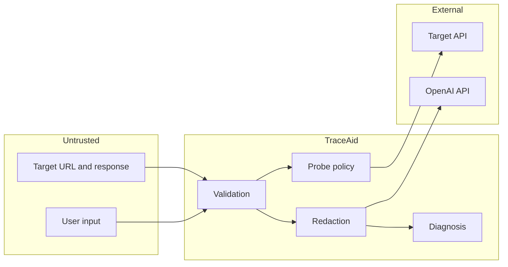

# Threat model

This document describes the main security and privacy risks for TraceAid. It is a practical engineering threat model, not a formal certification.

## Assets

- API credentials, cookies, authorization headers, and signed URLs submitted for diagnosis;
- proprietary request and response payloads;
- availability of the TraceAid service and its outbound network access;
- integrity of diagnoses and generated code;
- the configured OpenAI credential;
- internal services reachable from the deployment network.

## Trust boundaries

Input crosses an untrusted-to-application boundary. Optional probing crosses an application-to-network boundary. Optional AI enrichment crosses a data-processing/provider boundary.

## Threats and controls

| Threat | Example | Primary controls | Residual risk |
| --- | --- | --- | --- |
| Secret disclosure | Bearer token appears in a report, log, or AI prompt. | Recursive redaction, minimized prompts, body-free logging, ignored `.env`. | Novel secret formats may evade pattern-based redaction. |
| SSRF | A probe targets `127.0.0.1`, RFC1918 space, link-local metadata, or an internal hostname. | Probes off by default, scheme/host/IP validation, DNS checks, redirects not followed, bounded HTTP client. | DNS rebinding and unusual platform networks require egress filtering. |
| Parser injection | A pasted `curl` command uses shell expansion or `@file` to access local data. | Parse as text; never invoke a shell; reject unsupported file reads and control constructs. | Parser discrepancies can produce an inaccurate request representation. |
| Prompt injection | Error body tells the model to reveal secrets or ignore output rules. | Treat payload as quoted evidence, redact first, schema-constrained output, no tools/side effects, deterministic fallback. | The model may still provide a low-quality diagnosis within the schema. |
| Resource exhaustion | Very large body, slow endpoint, redirect loop, or high request volume. | Validation limits, timeout, response-byte cap, redirect limit, deployment rate limiting. | Application-level controls do not replace ingress quotas. |
| Cross-origin abuse | A hostile site invokes a developer's local TraceAid instance. | Explicit origin allowlist; no wildcard-with-credentials default. | Browser-independent callers are not constrained by CORS. |
| Generated-code misuse | A user executes a suggested destructive request. | Code is generated from a redacted representation, clearly labeled for review, and never auto-executed. | Users can still run unsafe code without inspection. |
| Error leakage | Stack trace or provider exception returns a key or payload. | Controlled exception mapping, generic client errors, sanitized logs. | Dependency bugs may expose unexpected fields. |
| Dependency compromise | A malicious or vulnerable package enters the build. | Narrow dependency set, Dependabot, `pip-audit`, CI, review of updates. | Version ranges are not a cryptographic lockfile. Production should pin resolved artefacts. |

## SSRF validation checklist

Before any live request, the implementation should verify all of the following:

1. the feature is enabled by the server and explicitly requested by the caller;
2. the scheme is `http` or `https` and the URL has no embedded credentials;
3. the host resolves, and every resolved address is globally routable and allowed;
4. loopback, private, link-local, multicast, unspecified, reserved, and metadata endpoints are blocked for IPv4 and IPv6;
5. redirects are either disabled or individually revalidated with a small maximum;
6. connect/read/write/pool timeouts are bounded;
7. the retained response body is capped and safely decoded;
8. forwarded request headers do not include host/proxy or hop-by-hop surprises;
9. logs and errors do not echo raw credentials or bodies.

Network policy should independently deny internal and metadata ranges.

## AI data handling

Only redacted evidence needed for diagnosis should be sent to the configured provider. The model is not given outbound tools, local file access, environment variables, or the provider API key as prompt content. Structured output is validated as untrusted input before use.

Operators are responsible for selecting an account and retention configuration compatible with their data policy. Users should submit synthetic examples whenever possible.

## Security test cases

At minimum, automated tests should cover:

- mixed-case secret headers and nested credential keys;
- tokens in query parameters and error strings;
- IPv4, IPv6, integer/encoded IP variants, and hostnames resolving to blocked ranges;
- a public URL redirecting to a private address;
- oversized and slow responses;
- shell operators, substitutions, and file arguments in `curl` input;
- prompt-injection text inside an observed response;
- malformed AI output and provider timeout fallback;
- client errors that never contain the original token.

## Accepted limitations

TraceAid does not claim to discover every secret, prove a root cause, safely proxy arbitrary traffic, or make generated code safe without review. Public deployments require authentication, rate limiting, TLS, network egress controls, monitoring, and an operator-approved data policy.
